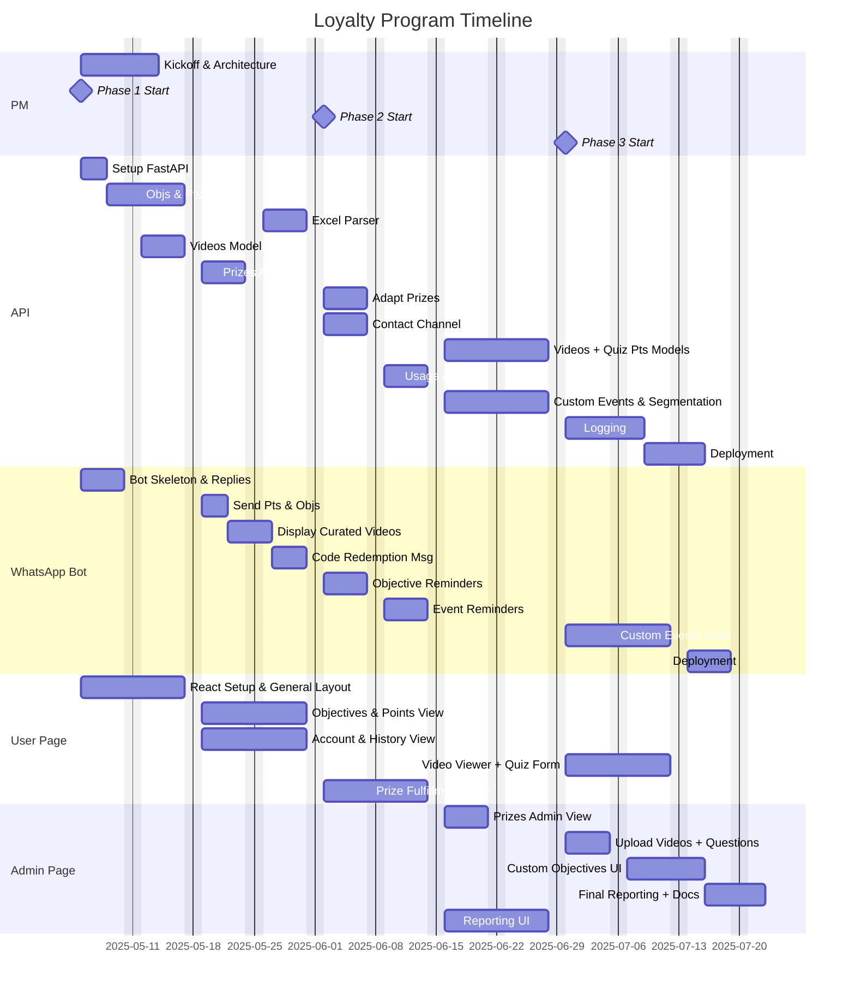

## 🧾 Project Title: Loyalty Program Platform

## 📌 Purpose
To create an internal-use platform for sellers, managers, regional managers, and executives to track performance, redeem prizes, and engage with communications and educational content. The system must support multi-role access, modular objectives, point systems, redemption, and communication delivery via web and WhatsApp.

---
## 👤 User Roles

- **Admin**: Has full access to all system features. Can assign new content (videos, objectives, prizes), manage users, assign objectives, upload sales files, and view/download reports.
- **Staff**: Can view user progress, assign objectives, upload sales files, and view/download reports.
- **User (Employee)**: Can view their own points, complete objectives, watch academy content, take quizzes, and redeem prizes.
## 👥 User Types

| Role             | Description                                               |
| ---------------- | --------------------------------------------------------- |
| Seller           | Main user completing objectives, redeeming prizes         |
| Manager          | Assigns objectives, monitors performance                  |
| Regional Manager | Oversees performance across areas                         |
| Executive        | Views global performance                                  |
| Admin            | Creates content (videos, events, prizes), handles reports |

---
# 📚 Functional Modules & Requirements
## ✅ API
### 1. User System
- **FR1.1**: The system must allow storing users with metadata (role, region, area, zone, chain).
- **FR1.2**: Admins can segment users based on this metadata.
- **FR1.3**: Authentication is pending either on company records or proprietary authentication system.
### 2. Objectives & Points
- **FR2.1**: Users are assigned sales or generic objectives from Excel input.
- **FR2.2**: Users are assigned custom objectives via the admin dashboard.
- **FR2.3**: When an objective is completed, the system awards a set amount of points.
- **FR2.4**: Objectives may be updated or marked complete via Excel input or internal events (e.g., video watched, event completed).
### 3. Excel Sales Input
- **FR3.1**: Admins can upload daily Excel files with sales data.
- **FR3.2**: The system must map the data to users and evaluate relevant objectives automatically.
### 4. Prize Redemption
- **FR4.2**: Points must be deducted upon prize redemption.
- **FR4.3**: Admins are shown a list of available prizes.
- **FR4.4**: Admins can mark prizes as delivered.
- **FR4.5**: If the prize is digital, the user must receive a code and be notified via WhatsApp.
### 5. Communication Videos & Academia
- **FR5.1**: Admins can upload communication videos and associated quizzes.
- **FR5.3**: Points are awarded for successful quiz completion.
- **FR5.4**: Only users in target segments (tier, region, etc.) can view relevant content.
### 6. Flash Events / Promotions
- **FR6.1**: Admins can create temporary events (e.g., send a photo).
- **FR6.2**: Events can be configured with point rewards upon successful user completion.
- **FR6.3**: Events must support expiration dates and participation limits.
### 7. Administration
- **FR7.1**: Admins can download reports by type, user, date, prize, or event.
### 8. Segmentation
- **FR8.1**: Admins can filter and target content by channel, region, and area.
### 9. Audit Logs
- **FR9.1**: All prize redemptions, objective completions, and admin actions must be logged.
- **FR9.2**: Logs must be queryable by date, user, or module.
---
## 💬 WhatsApp Bot
### 1. Bot Interaction
- **FRW1.1**: Users can query their current points and active objectives via WhatsApp.
- **FRW1.2**: Users can redeem prizes through WhatsApp and receive confirmation.
- **FRW1.3**: Bot must gracefully handle invalid inputs or unknown commands.
- **FRW1.4**: ~~Users can submit flash event participation (e.g., send photo, text response).~~ *(Postponed for future phase)*
### 2. Push Notifications
- **FRW2.1**: Users receive automated messages for:
  - Pending objective assignments
  - Prize approvals
  - Communications
### 3. Prize Interaction
- **FRW3.1**: Upon redeeming a digital prize, the user receives the code and instructions via WhatsApp.
- **FRW3.2**: Confirmation messages are sent for every redemption action.
---
## 🌐 React Web Page
### 1. Authentication & Routing
- **FRR1.1**: Users must authenticate via token-based or magic link login.
- **FRR1.2**: Role-based routing for admin, staff, and regular users.
### 2. User Dashboard
- **FRR2.1**: Users can view their profile, current objectives, and accumulated points.
- **FRR2.2**: Users can view their quiz history, rewards claimed, and status of prize delivery.
### 3. Reward Catalog
- **FRR3.1**: Users can browse rewards and check eligibility.
- **FRR3.2**: Users can redeem prizes through the interface.
- **FRR3.3**: Filter and sort rewards by category, tier requirement, or stock availability.
### 4. Academy Section
- **FRR4.1**: Display categorized video content: generic, suggested, or targeted.
- **FRR4.2**: Display and submit associated quizzes.
- **FRR4.3**: Confirm point assignment after successful quiz submission.
### 5. Admin Tools
- **FRR5.1**: Admins can upload and manage video and quiz content via the admin panel.
- **FRR5.2**: Admins can create and configure custom objectives from the admin panel.
- **FRR5.3**: Admins can manage the reward catalog, including creating, editing, and deleting prize entries.
- **FRR5.4**: Admins can update the delivery status of redeemed physical prizes.
- **FRR5.5**: Dashboard for monitoring user participation and overall progress.
- **FRR5.6**: Filterable KPIs and reporting interface (exportable CSV, PDF, or charts).
---
## 🛠 Non-Functional Requirements (brief)
- NFR1: The system must respond within 1s for API actions under 1000 concurrent users.
- NFR2: The platform must be mobile-friendly.
- NFR3: WhatsApp responses must be handled asynchronously and logged.
- NFR4: The system must ensure access control by role.
- NFR5: The web platform should have a design in compliance with the company's guidelines

---

